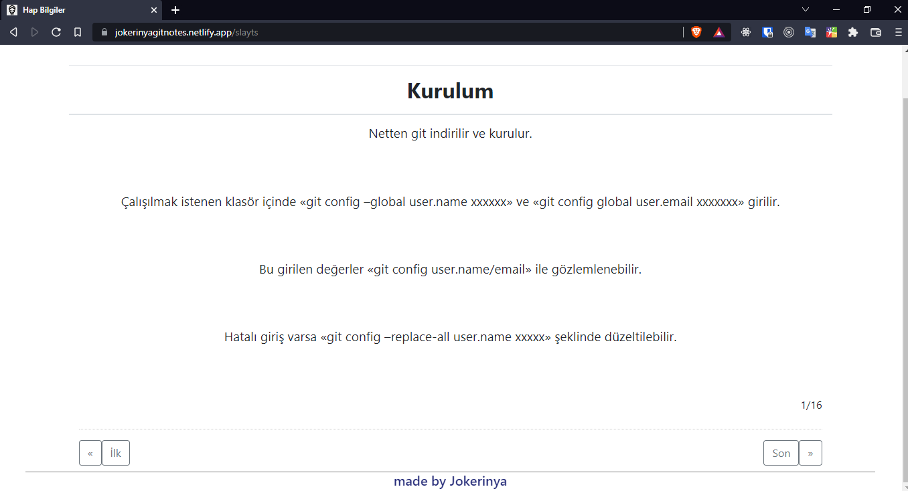

# Git Notes

These project is about `git` and `github`. In this project, I share my humble knowledge about `git` and `github` in the net on this `VueJs SPA (Single Page Application)`.

👉This site is online at <a href="https://jokerinyagitnotes.netlify.app" target="_blank">here</a>



## In this site I learned and practiced

-   `Git` and `Github` knowledge,
-   `Bootstrap4` and `pagination`,
-   `Vuex` and `VueRouter`.

## Project setup

```
npm install
```

### Compiles and hot-reloads for development

```
npm run serve
```

### Compiles and minifies for production

```
npm run build
```

### Lints and fixes files

```
npm run lint
```

### Customize configuration

See [Configuration Reference](https://cli.vuejs.org/config/).
